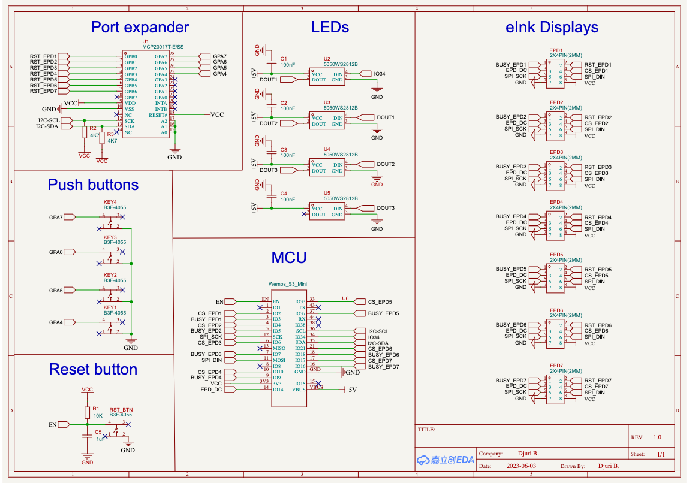

# BTClock v2

Improved code for BTClock with many features.
Don't forget to copy `config.h.example` to `config.h`. Not necessary to adapt it, since everything should be configurable through the WebUI.

### Button actions

(Top = 1 to bottom = 4)

1. Start/stop timer (confirmed with LEDs)
2. Next screen
3. Previous screen
4. Show IP address

## Software

- [PlatformIO](https://platformio.org/platformio-ide).
- [Node.js](https://nodejs.org/en) and [yarn](https://yarnpkg.com/).

## Hardware 

See [wiki](https://github.com/dsbaars/btclock_v2/wiki) for requirements and build instructions.

## Schematic

